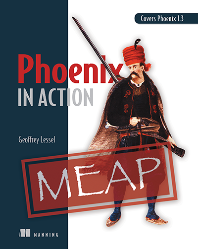

# Phoenix in Action

Thanks for checking out the code listings and snippets from Phoenix in
Action!

As the book goes through the MEAP process, I will be attempting to
keep this repo up to date with what is available in MEAP. The
organization will be by chapter. Inside each chapter directory, you'll
be able to see how the project code should look by the end of that
specific chapter.

Please let me know if you spot any errors or if any listing does not
work for you.

## Buy the book!

If you don't already have the book, you can [buy it from Manning][pia].

[pia]: https://www.manning.com/books/phoenix-in-action?a_aid=geolessel&a_bid=80a2cec0
